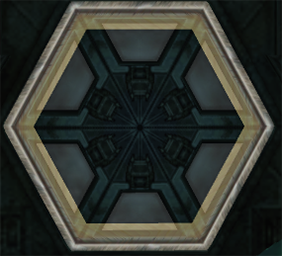
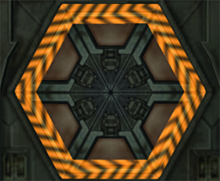
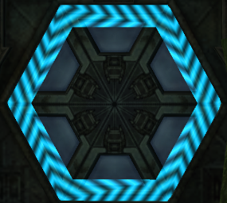
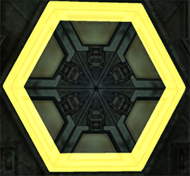
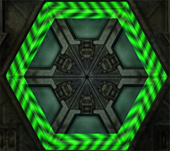
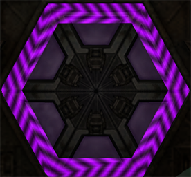
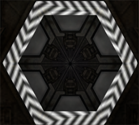
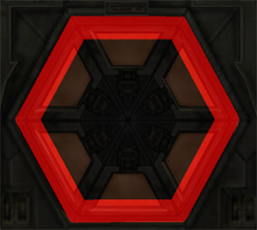
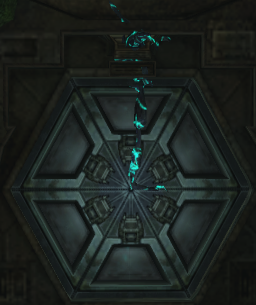
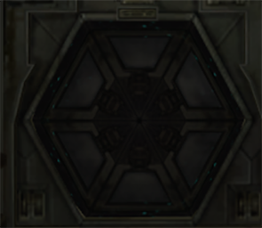

# Custom Doors
Plandomizers can make use of 10 non-vanilla door types. These are designated on the map by a grey door, except for beam combo doors which use the combo's base beam color. Note that these aren't "locks" like the vanilla missile locks, so you'll need enough missiles and power bombs to pass through each door every time. Watch out for soft-locking due to not having enough resources. Here are what the doors look like.

## Missile

## Morph Ball Bomb

## Charge Beam

## Power Bomb

## Super Missile

## Wavebuster

## Ice Spreader

## Flamethrower

## Enemy Door
This door only opens to AI weapons, so you'll have to bait enemies to shoot the door for you. It definitely works with Bloodflowers, Chozo Ghosts and Space Pirates. There may be more, but you'll have to get creative to find them. The door frame is made out of a T-posing Chozo Ghost to help you remember what this door means.

## Disabled
All weapons will be absorbed by this door rather than reflected to indicate it is impervious to all damage.

